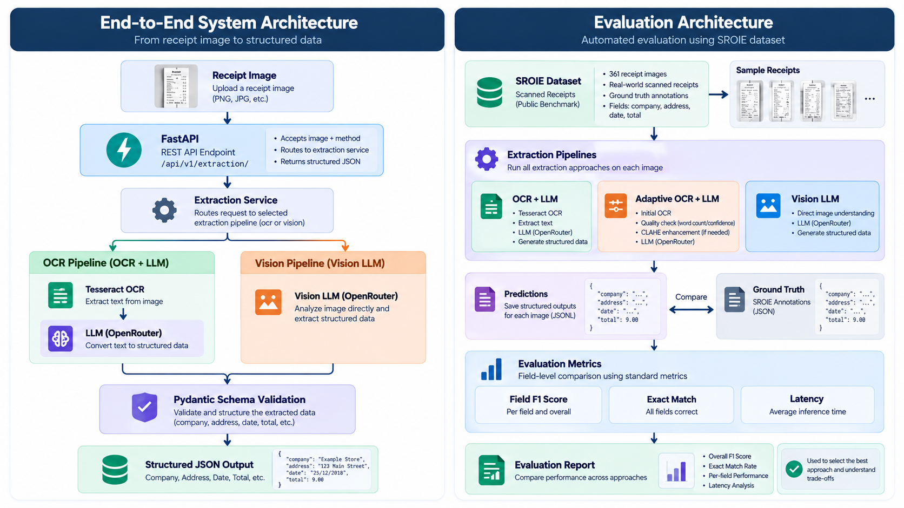

# Document Intelligence & Information Extraction System

An end-to-end document intelligence system that extracts structured information from receipt images.

The project explores three extraction approaches:

1. OCR + LLM
2. Adaptive OCR + LLM
3. Direct Vision LLM extraction

It uses the SROIE receipt dataset for evaluation and exposes the extraction pipelines through a FastAPI API. The application is containerized with Docker and deployed to Railway.

## Overview

Receipt images can contain poor lighting, low contrast, unusual layouts, noisy text, and inconsistent formatting. This project explores how different extraction architectures perform under these conditions.

The system extracts four fields:

- Company
- Address
- Date
- Total

The project covers document ingestion, OCR, image preprocessing, LLM-based extraction, vision-based extraction, schema validation, automated evaluation, REST API development, Docker containerization, and cloud deployment.

## System Architecture



### Request flow

```text
Receipt Image
      |
      v
   FastAPI
      |
      v
Extraction Service
      |
      +-------------------+
      |                   |
      v                   v
 OCR Pipeline       Vision Pipeline
      |                   |
 Tesseract OCR       Vision LLM
      |                   |
      v                   |
     LLM                  |
      |                   |
      +---------+---------+
                |
                v
      Pydantic Validation
                |
                v
        Structured JSON
```

## Key Features

- Receipt information extraction from images
- OCR + LLM extraction pipeline
- Adaptive OCR with contrast enhancement fallback
- Direct vision-based extraction
- Structured output using Pydantic
- FastAPI REST API
- Automated evaluation on 361 SROIE receipts
- Field-level F1 and exact-match evaluation
- Latency measurement
- Dockerized application
- Production deployment on Railway

## Extraction Approaches

### 1. OCR + LLM

The baseline architecture separates document reading from information extraction.

```text
Receipt Image
      |
      v
Tesseract OCR
      |
      v
Extracted Text
      |
      v
LLM
      |
      v
Structured Receipt
```

The LLM does not receive the original receipt image. It receives the text produced by the OCR stage.

This creates a two-stage pipeline:

1. OCR converts pixels into text.
2. The LLM converts text into structured information.

### 2. Adaptive OCR + LLM

The adaptive OCR pipeline keeps the same OCR + LLM architecture but adds a quality-based fallback.

After the initial OCR pass, the system checks:

- Number of extracted words
- Average OCR confidence

If the result appears unreliable, the image is enhanced using CLAHE and OCR is run again.

```text
Receipt Image
      |
      v
Initial OCR
      |
      v
OCR Quality Check
      |
      +-------------------+
      |                   |
      v                   v
   Good OCR          Poor OCR
      |                   |
      |                   v
      |             CLAHE Enhancement
      |                   |
      |                   v
      |              Second OCR
      |                   |
      +---------+---------+
                |
                v
        Extracted Text
                |
                v
               LLM
                |
                v
        Structured Receipt
```

Architecturally, this is still an OCR-first system. The difference is that the OCR stage can attempt to recover from low-quality results before the LLM performs extraction.

### 3. Vision LLM

The vision architecture removes the separate OCR stage.

Instead of converting the receipt image into text first, the image is provided directly to a vision-capable language model.

```text
Receipt Image
      |
      v
Vision LLM
      |
      v
Structured Receipt
```

The architectural difference is:

```text
OCR + LLM

Image
  |
  v
OCR
  |
  v
Text
  |
  v
LLM
  |
  v
Structured Data


Vision LLM

Image
  |
  v
Vision LLM
  |
  v
Structured Data
```

The OCR approaches therefore use a dedicated transcription stage before information extraction, while the vision approach performs document understanding and information extraction directly from the image.

## Evaluation

The three extraction approaches were evaluated using **361 receipt images from the SROIE dataset**.

Each prediction was compared against the dataset's ground-truth annotations for:

- Company
- Address
- Date
- Total

The evaluation measures:

- Field-level F1
- Exact match
- Average inference latency

### Overall Evaluation Results

| Approach           | Overall F1 | Exact Match | Average Latency |
| ------------------ | ---------: | ----------: | --------------: |
| OCR + LLM          |      0.801 |       0.607 |           4.79s |
| Adaptive OCR + LLM |      0.858 |       0.648 |           7.33s |
| Vision LLM         |      0.854 |       0.699 |          10.32s |

### Field-Level F1 Results

| Field       | OCR + LLM | Adaptive OCR + LLM | Vision LLM |
| ----------- | --------: | -----------------: | ---------: |
| Company     |     0.813 |              0.831 |      0.798 |
| Address     |     0.862 |              0.908 |      0.888 |
| Date        |     0.708 |              0.790 |      0.824 |
| Total       |     0.823 |              0.903 |      0.909 |
| **Overall** | **0.801** |          **0.858** |  **0.854** |

### Field-Level Exact Match Results

| Field       | OCR + LLM | Adaptive OCR + LLM | Vision LLM |
| ----------- | --------: | -----------------: | ---------: |
| Company     |     0.598 |              0.601 |      0.673 |
| Address     |     0.521 |              0.529 |      0.632 |
| Date        |     0.485 |              0.557 |      0.582 |
| Total       |     0.823 |              0.903 |      0.909 |
| **Overall** | **0.607** |          **0.648** |  **0.699** |

For the `total` field, F1 is equivalent to exact match because the metric is evaluated as a binary numerical match.

### Interpreting the Results

The results show measurable differences between the three architectures.

The baseline OCR + LLM pipeline had the lowest overall F1 and the lowest average latency.

Adding adaptive OCR improved overall F1 from **0.801 to 0.858**. The additional processing comes from checking OCR quality and selectively running contrast enhancement and a second OCR pass.

The Vision LLM pipeline achieved an overall F1 of **0.854** and the highest overall exact-match rate of **0.699**, while also having the highest average latency at **10.32 seconds**.

These results illustrate the trade-offs between a multi-stage OCR pipeline, an OCR pipeline with adaptive preprocessing, and direct image-based extraction.

## Evaluation Architecture

The evaluation pipeline runs all three extraction approaches against the same set of receipt images and compares their predictions with the ground-truth annotations.

```text
SROIE Dataset
      |
      v
361 Receipt Images
      |
      v
+----------------------------+
| Extraction Approaches      |
|                            |
| OCR + LLM                  |
| Adaptive OCR + LLM         |
| Vision LLM                 |
+-------------+--------------+
              |
              v
        Predictions
              |
              v
      Ground Truth Comparison
              |
              v
+----------------------------+
| Evaluation Metrics         |
|                            |
| Field F1                   |
| Exact Match                |
| Latency                    |
+-------------+--------------+
              |
              v
       Evaluation Report
```

The same dataset and evaluation logic are used across the approaches so their results can be compared consistently.

## API

### Endpoint

```text
POST /api/v1/extraction/
```

The endpoint accepts:

- `image`: receipt image
- `method`: `ocr` or `vision`

### Example Request

```bash
curl -X POST https://YOUR-RAILWAY-URL/api/v1/extraction/ \
  -F "image=@receipt.png" \
  -F "method=vision"
```

For OCR:

```bash
curl -X POST https://YOUR-RAILWAY-URL/api/v1/extraction/ \
  -F "image=@receipt.png" \
  -F "method=ocr"
```

### Example Response

```json
{
  "company": "Example Store",
  "address": "123 Main Street",
  "date": "25/12/2018",
  "total": 9.0
}
```

The response is validated using a Pydantic schema before being returned by the API.

Interactive Swagger documentation is available at `/docs`.

## Project Structure

```text
document-intelligence/
├── data/
├── notebooks/
├── src/
│   ├── api/
│   │   ├── main.py
│   │   ├── schemas.py
│   │   └── routes/
│   │       └── extraction.py
│   ├── extraction/
│   │   ├── llm.py
│   │   └── vision_model.py
│   ├── ocr/
│   │   ├── base.py
│   │   └── tesseract.py
│   ├── pipeline/
│   │   ├── document.py
│   │   └── vision.py
│   ├── schemas/
│   │   └── receipt.py
│   ├── evaluation/
│   │   ├── metrics.py
│   │   ├── run_evaluation.py
│   │   ├── run_vision_evaluation.py
│   │   ├── analyze_results.py
│   │   ├── inspect_ocr.py
│   │   └── save_failed_images.py
│   ├── extraction_service.py
│   └── tests/
│       └── test_api.py
├── evaluation_results/
├── docs/
│   └── architecture.png
├── Dockerfile
├── .dockerignore
├── pyproject.toml
├── uv.lock
└── README.md
```

## Local Development

### Requirements

- Python 3.14
- uv
- Tesseract OCR
- OpenRouter API key

### Setup

```bash
git clone YOUR_REPOSITORY_URL
cd document-intelligence
uv sync
```

Create a `.env` file:

```env
OPENROUTER_API_KEY=your_api_key
```

For local Windows development, if Tesseract is not available on your PATH:

```env
TESSERACT_CMD=C:\Program Files\Tesseract-OCR\tesseract.exe
```

The application defaults to `tesseract` when the variable is not provided, which allows the same code to run inside the Linux Docker container.

### Start the API

```bash
uv run uvicorn src.api.main:app --reload
```

Then open:

```text
http://localhost:8000/docs
```

## Running Tests

The API includes tests for vision extraction, OCR extraction, unsupported file types, missing files, and invalid extraction methods.

```bash
uv run pytest
```

## Docker

The application is packaged as a Docker container with the required Python and Linux system dependencies, including Tesseract OCR.

### Build

```bash
docker build -t document-intelligence .
```

### Run

```bash
docker run --env-file .env -p 8000:8000 document-intelligence
```

## Deployment

The application is deployed to **Railway** using the Dockerfile.

The production deployment supports both OCR and vision extraction methods.

```text
Client
   |
   v
Railway
   |
   v
Docker Container
   |
   v
FastAPI
   |
   +------------------+
   |                  |
   v                  v
OCR Pipeline     Vision Pipeline
   |                  |
   +--------+---------+
            |
            v
     Structured JSON
```

Both extraction methods have been tested successfully in the deployed environment.

## Engineering Decisions

### Why multiple extraction pipelines?

Rather than assuming that one architecture would work best, the project evaluates different ways of solving the same document extraction problem.

This makes it possible to compare extraction quality, exact-match performance, latency, and pipeline complexity.

### Why use schema validation?

LLM output can be inconsistent even when the extracted information is correct.

Pydantic provides a defined contract for the API response:

```python
class Receipt(BaseModel):
    company: str
    address: str
    date: str
    total: float
```

This keeps the API response predictable and makes downstream integration easier.

### Why evaluate on a public dataset?

The SROIE dataset provides a consistent set of receipt images and ground-truth annotations.

This makes it possible to evaluate changes to the extraction pipeline against the same benchmark rather than relying on a few manually selected examples.

## Limitations

- The current system focuses on receipt documents and four fields.
- Performance can vary with image quality and receipt layout.
- LLM-based extraction introduces inference latency and API costs.
- Tesseract OCR can struggle with heavily degraded or unusual receipts.
- The evaluation dataset does not represent every type of real-world document.

## Future Improvements

- Support additional document types
- Add more document-specific schemas
- Benchmark additional OCR and vision models
- Add confidence-based routing between extraction approaches
- Expand latency and cost benchmarking
- Evaluate on larger and more diverse datasets
- Improve document preprocessing

## Tech Stack

**Language:** Python

**API:** FastAPI, Pydantic

**Document Processing:** Tesseract OCR, OpenCV, Pillow

**AI:** OpenRouter, large language models, vision language models

**Evaluation:** SROIE, field-level F1, exact match, latency measurement

**Infrastructure:** Docker, Cloud Deployment(Railway), uv
